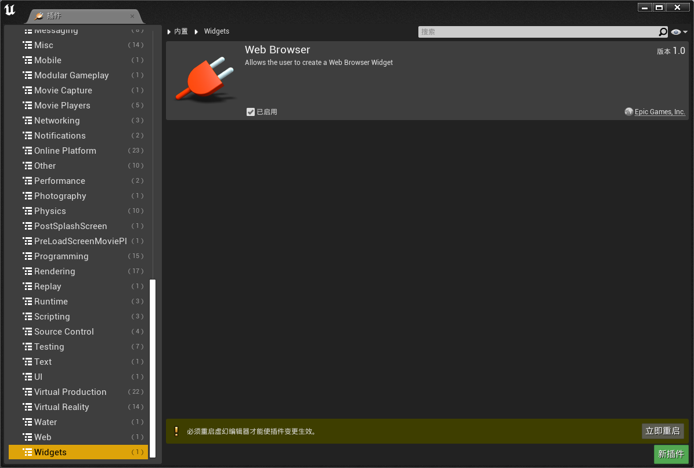
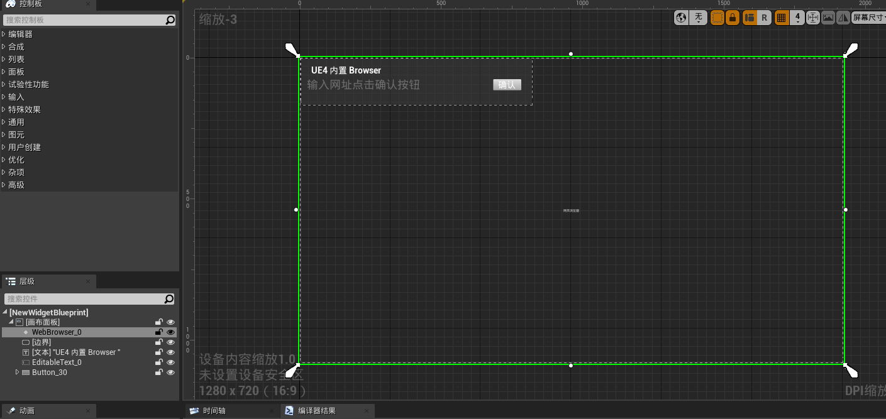
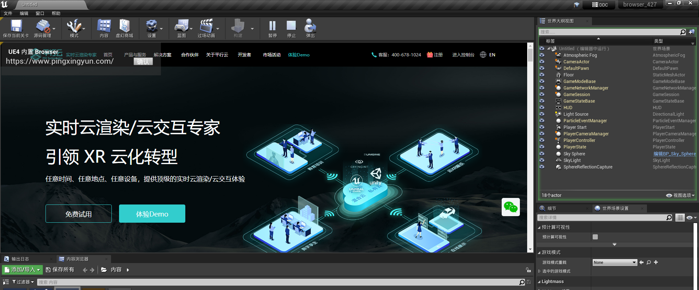
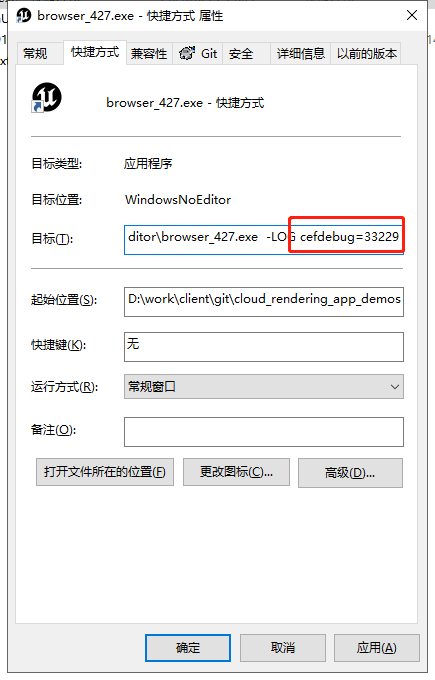
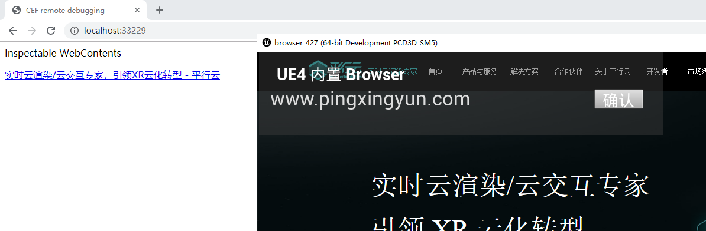
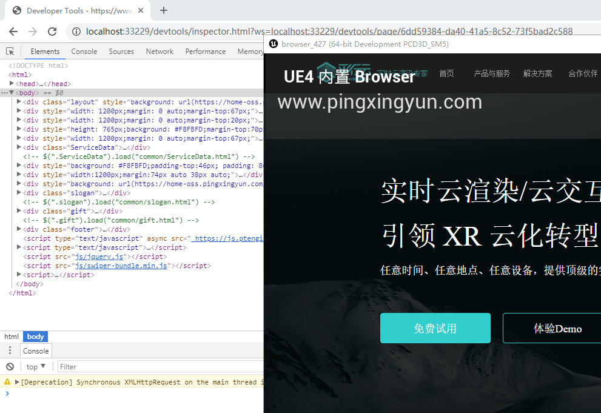

使用 UE 内置的浏览器内核（cef）在UE内打开并显示网页

1. 启用浏览器组件插件



2. 引用浏览器组件



运行效果



3. 如何调试

1.) 添加启动参数

```param
cefdebug=33229
```



2.) 浏览器打开

```url
http://localhost:33229/
```





> 如果浏览器报错需要使用chrome79以下版本访问。
