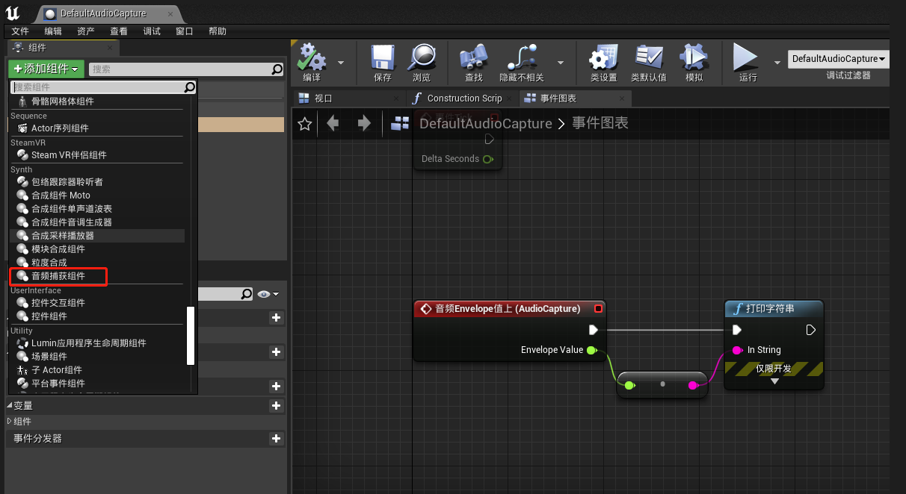
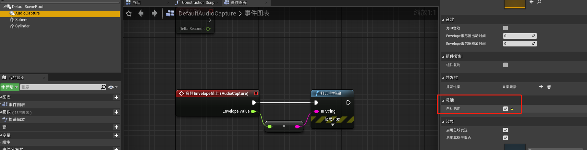
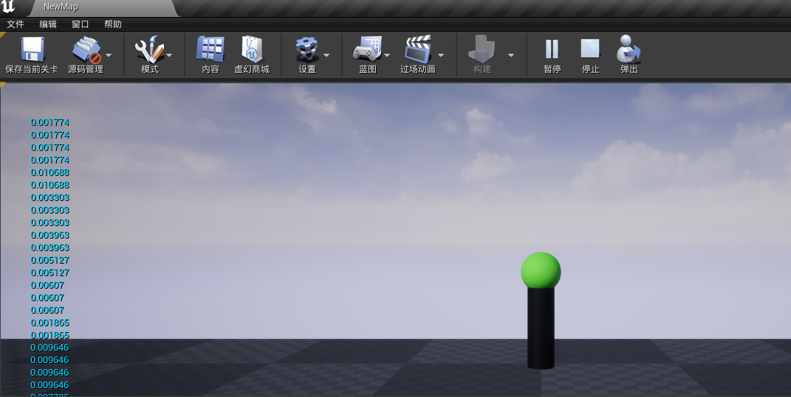
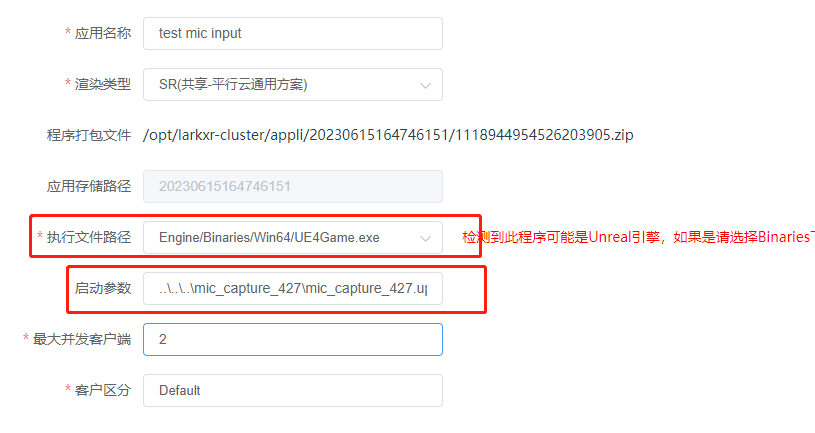

启用麦克风输入并上传至平行云 LarkXR 云渲染

1. 新建 Actor 并添加音频捕获组件，并放置在场景中，启用默认激活

2. 在编辑器启动，连有麦克风的情况下这时可以听到麦克风传来的声音，并有打印值

3. 上传至平行云 LarkXR 后台，填写正确路径和启动参数

4. 通过网页访问云渲染效果. 打开网页端麦克风后可以听到麦克风的声音并有打印的值

> 浏览器邀请 https 或本地 localhost 访问才可以获得麦克风权限。