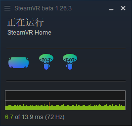
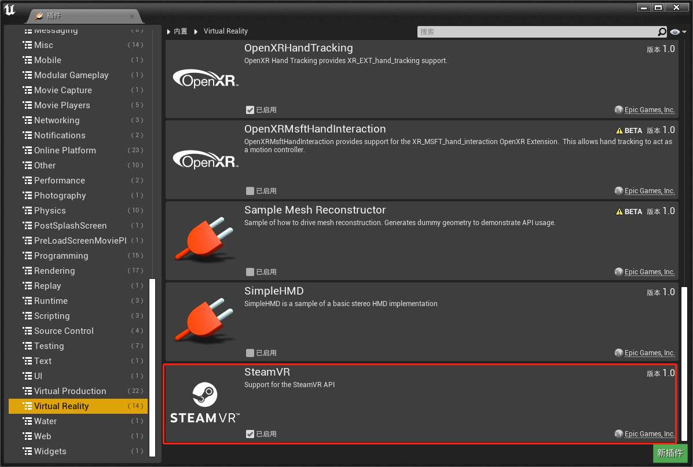
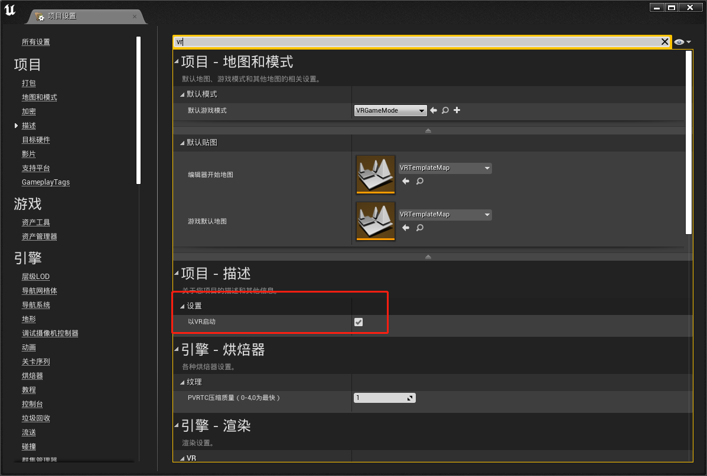
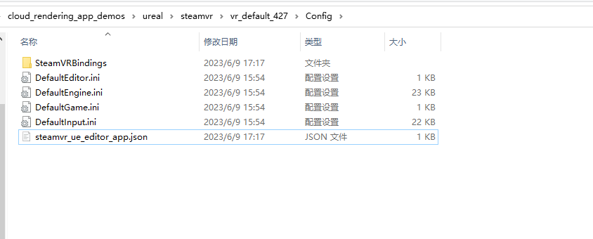
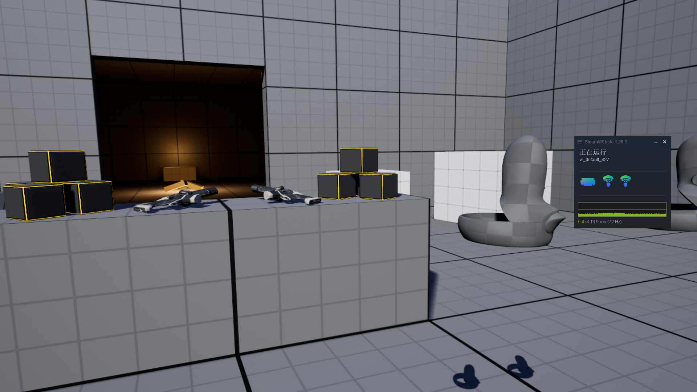
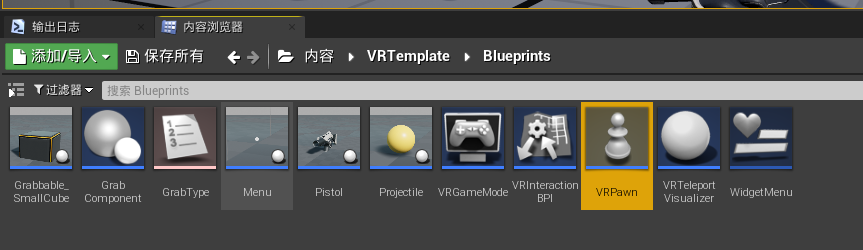
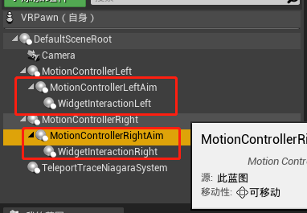

# SteamVR

接入 SteamVR 可用于平行云后台以下类型的应用：

* VR(SteamVR共享)
* VR(SteamVR独占)	
* VR(Nvidia VR方案)	
* AR(平行云AR方案)	
* AR(Nvidia AR方案)

适用于适用 Quest, Pico, HTC 等头显设备访问。需要支持双面立体渲染和手柄输入时使用。

## UE 中环境和项目设置

> 参考 https://docs.unrealengine.com/4.27/en-US/SharingAndReleasing/XRDevelopment/VR/VRPlatforms/SteamVR/HowTo/SteamVRInput/
> https://docs.unrealengine.com/4.27/en-US/SharingAndReleasing/XRDevelopment/VR/VRPlatforms/SteamVR/BestPractices/

* UE 开发机器要安装好 SteamVR 环境并连接头显。用于 UE 生成 StreamVR 输入的绑定文件

* UE 工程中要启动 SteamVR 插件

* UE 工程中项目设置搜索 VR，打开以 VR 方式启动

* 正常情况下 UE 会生成默认的绑定文件。可以在 便捷->项目设置->插件->StreamVR 中重新生成绑定文件

* 打包运行效果如下图

* 如果测试 UE 默认模板，新版 UE 中要手动修改下 VRPawn 蓝图。如下图所示，把 MotionControler[Left/Right]Aim 挂载到 MoticonControler 下面

